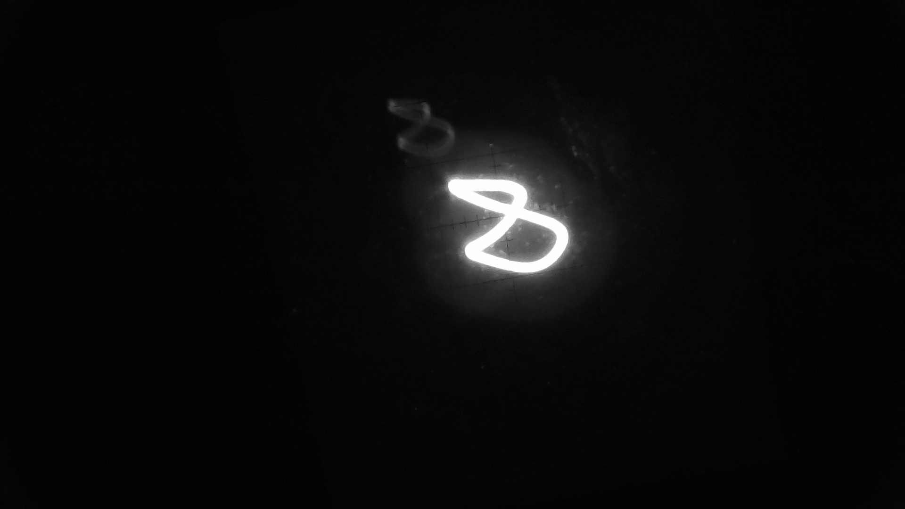
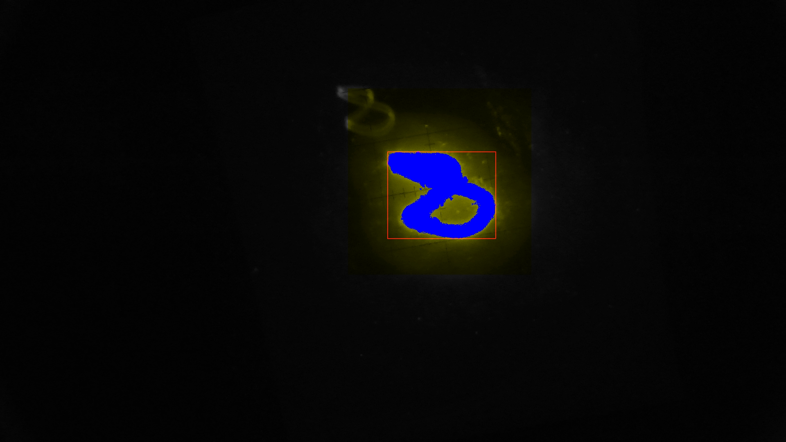

# Simple single blob detector

This is a really simple blob detector that locates a single
bright cluster on an webcam image. It has been used during electron
beam diagnosis. This application might not be useful for anything
else than the task it has been designed (or better call it hacked) for.
This application is based on one of my [blog posts about webcam
access from C](https://www.tspi.at/2021/02/06/webcamcapture.html)

Depends on:

* [libjpeg](https://github.com/mozilla/mozjpeg)
* In case Siglent SSG3021X should be controlled for frequency
  sweep [rawsockscpitools](https://github.com/tspspi/rawsockscpitools)

It works on a really simple principle (no DoG pyramids, scale spaces, etc.)
by simply:

* Optionally setting the frequency on an Siglent frequency generator. This
  requires the [raw socks SCPI library](https://github.com/tspspi/rawsockscpitools)
* Capturing a frame
* Doing a grayscale transformation
* Locating the pixel with maximum brightness (seed pixel)
* Associating each pixel in the neighborhood of a cluster pixel with
  the cluster if it's intensity is above a given threashold
* Determining the spatial size (in pixel) of the cluster
* Outputting the size and sum of intensity values to a measurement file

All data is stored into specific files when doing multiple measurements
using the signal generator.

